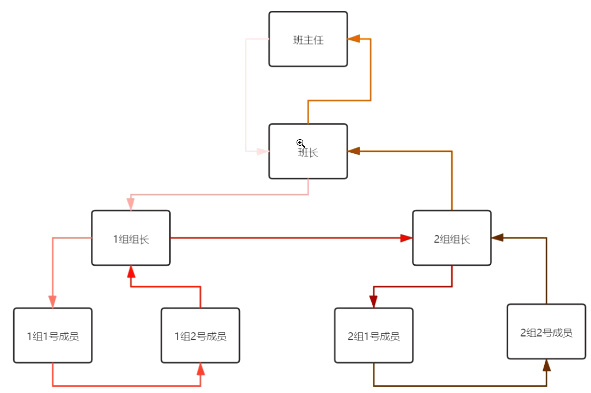
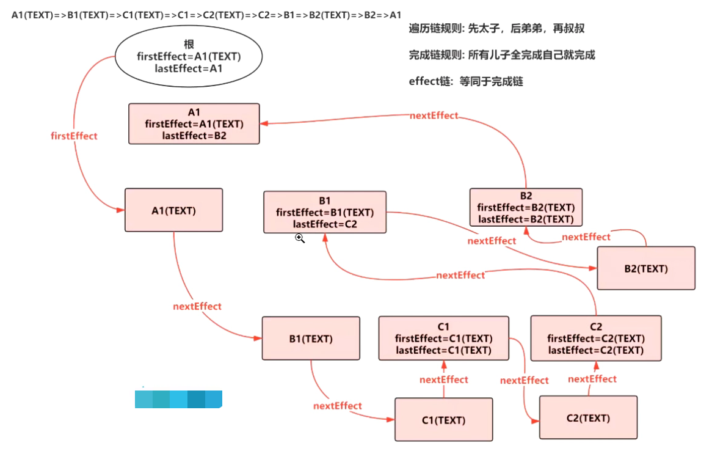
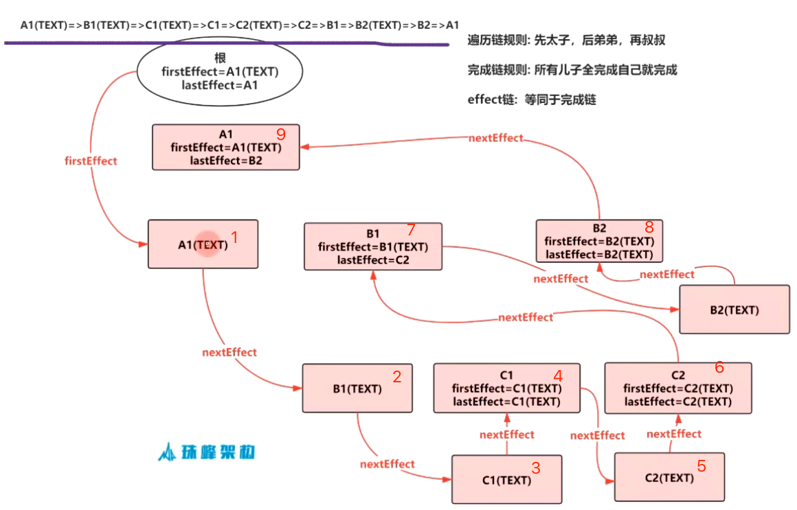

## 实现虚拟DOM


src/index.js
```jsx
import React from 'React'
import ReactDOM from 'react-dom'

let element = (
    <div id='A1'>
      A1
        <div id='B1'>
          B1
            <div id='C1'>C1</div>
            <div id='C2'>C2</div>
        </div>
        <div id='B2'>
          B2
        </div>
    
    </div>
)

console.log(element);

ReactDOM.render(
    element,
    document,getElementById('root')
)
```

src/react.js
```js
function createElement(type,config,...children) {
  delete config.__self;
  delete config.__source;
  return {
    type,
    props:{
      ...config,
      children: children.map(child =>{
        //兼容处理，如果是React元素返回自己，如果是一个字符串的话,返回文本节点
        return typeof child === 'object' ? child:{
          type: ELEMENT_TEXT,
          props:{
            text: child,
            children:[]
          }
        }
      })
    }
  }
}


const React={
  createElement
}

export default React;
```

## 实现初次渲染


### constant.js
```js
//表示一个文本元素
export const ELEMENT_TEXT = Symbol.for('ELEMENT_TEXT');
//React应用需要一个根Fiber
export const TAG_ROOT = Symbol.for('TAG_ROOT');
//原生的节点 span div p 函数组件 类组件
export const TAG_HOST = Symbol.for('TAG_HOST');
//文本节点
export const TAG_TEXT = Symbol.for('TAG_TEXT');
//类组件
export const TAG_CLASS = Symbol.for('TAG_CLASS');
//函数组件
export const TAG_FUNCTION_COMPONENT = Symbol.for('TAG_FUNCTION_COMPONENT');
//新增节点
export const PLACEMENT = Symbol.for('PLACEMENT');
//删除节点
export const DELETION = Symbol.for('DELETION');
//更新节点
export const UPDATE = Symbol.for('UPDATE');
```
## effect链



以上是遍历的时候完成的顺序 <br>

```html
 <div id='A1'>
      A11   
        <div id='B1'>
          B11
            <div id='C1'>C11</div>
            <div id='C2'>C22</div>
        </div>
        <div id='B2'>
          B22
        </div>
    
    </div>
```
A1的儿子: A11,B1,B2  <br>
A11没有儿子;  <br>
B1的儿子: B11,C1,C2  <br>
B2的儿子: B22  <br>
B11没有儿子;  <br>
C1的儿子:C11 <br>
C2的儿子:C22  <br>
C11没有儿子  <br>
C22没有儿子  <br>

遍历链: <br>
A11 =>B11 =>C11 =>C1 =>C22 =>C2 =>B1 =>B22 =>B2 =>A1

整个过程阐述:<br>
A11完成之后就继续B1的部分(按照儿子-》兄弟-》叔叔原则),B1的部分包含B11,C1,C2

B11完成之后继续C1部分,C1包含C11, C11完成之后C1就完成了(根据所有儿子完成就自己完成的原则)

C1完成之后开始C2部分,C2包含C22,同理,C22完成之后C2就完成了

而B1包含B11,C1,C2,这三者都完成了,故B1也完成了,下面就是B2部分,B2包含B22,B22完成之后B2就完成了

A11,B1,B2 就这样都完成了,而A1包含A11,B1,B2 ,故此时A1也就完成了！


还有一个注意点:

>每个fiber有两个属性:firstEffect指向第一个儿子(有副作用的子fiber),lastEffect指向最后一个儿子(有副作用的子fiber)，中间用nextEffect做成单链表

