## 不错资源

https://www.zhihu.com/people/di-xu-guang-50/zvideos

https://www.youtube.com/watch?v=PJeNReqyH88

https://code.visualstudio.com/docs/editor/debugging#_launch-configurations


## 具体例子

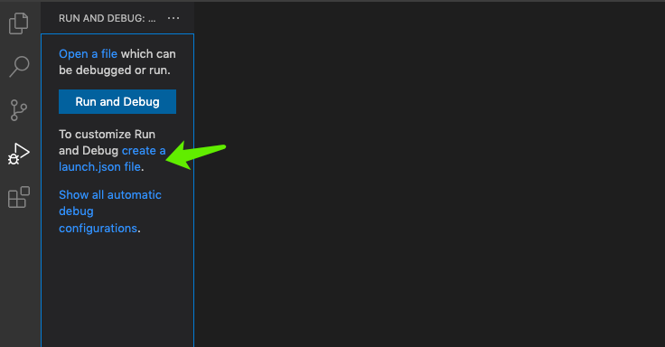

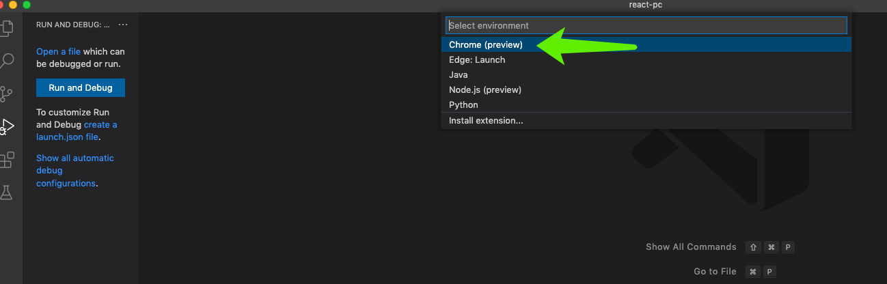


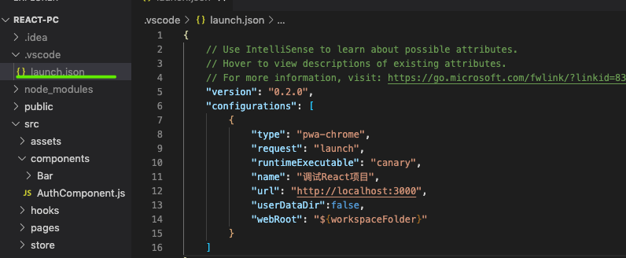

```shell
{
    // Use IntelliSense to learn about possible attributes.
    // Hover to view descriptions of existing attributes.
    // For more information, visit: https://go.microsoft.com/fwlink/?linkid=830387
    "version": "0.2.0",
    "configurations": [
        {
            "type": "pwa-chrome",
            "request": "launch",
            "runtimeExecutable": "canary",//表示使用 chrome 的金丝雀版本进行调试
            "name": "调试React项目",
            "url": "http://localhost:3000",
            "userDataDir":false,
            "webRoot": "${workspaceFolder}"
        }
    ]
}
```

### 如何设置snippets(自动补全)

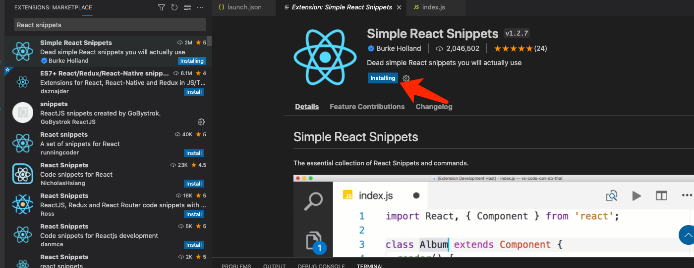

command + shift + p  

输入 configure user snippets

而后新建一个全局的:

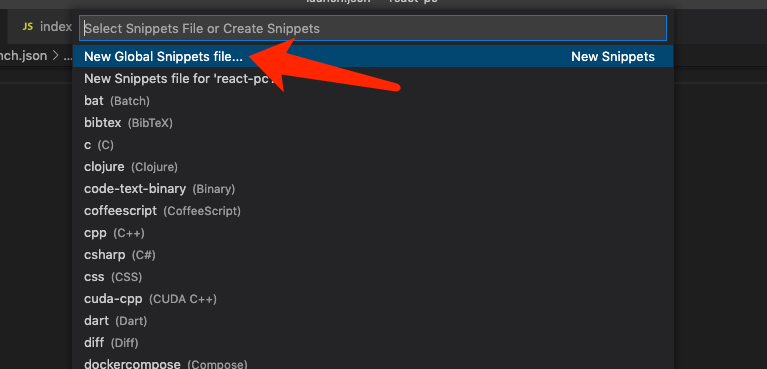

下面这个是默认的:

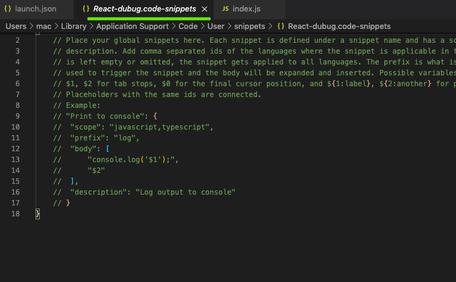

snippet-generator.app

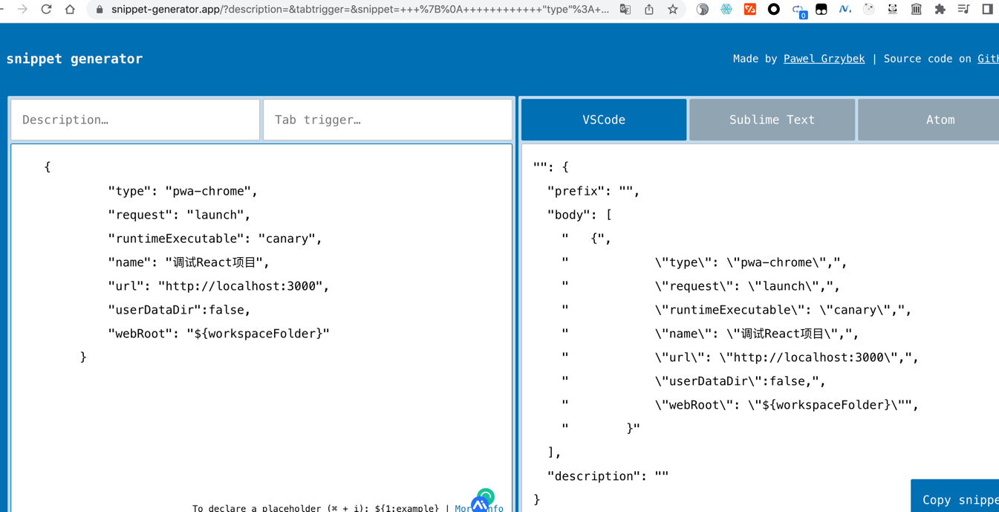

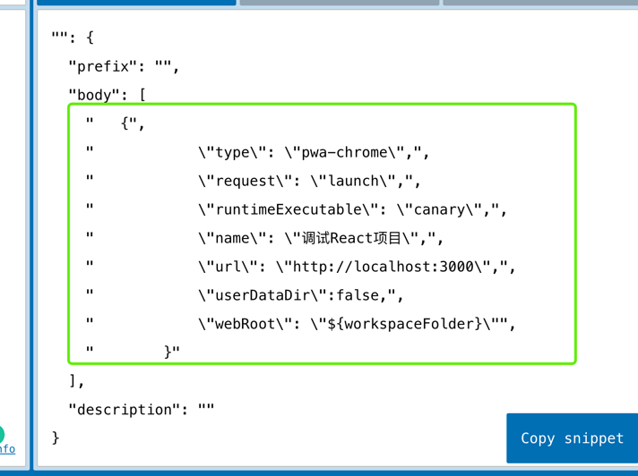

```
{
            "type": "pwa-chrome",
            "request": "launch",
            "runtimeExecutable": "canary",
            "name": "调试React项目",
            "url": "http://localhost:3000",
            "userDataDir":true,//这个选项为true或者不用这一行才能正确调试,不然url出不了
            "webRoot": "${workspaceFolder}"
        }
```
添加转义符号:

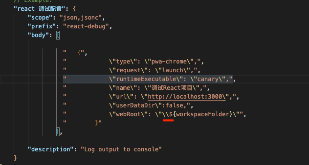

演示一下补全(如果不添加转移符号):

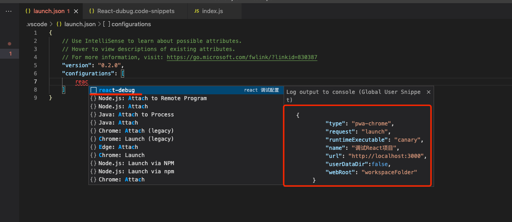

添加转义符号 之后:

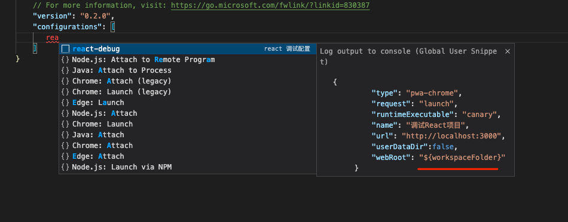


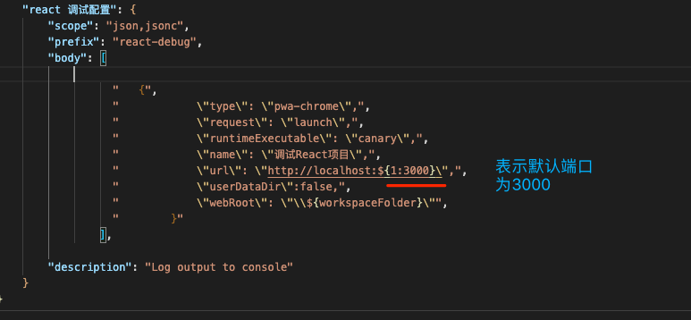

最后开启调试:

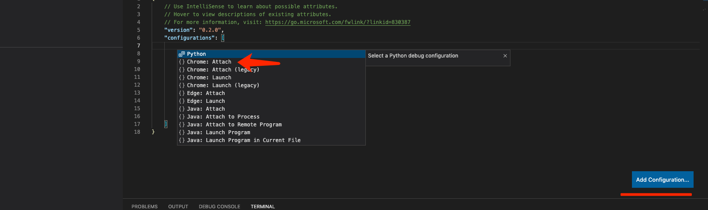

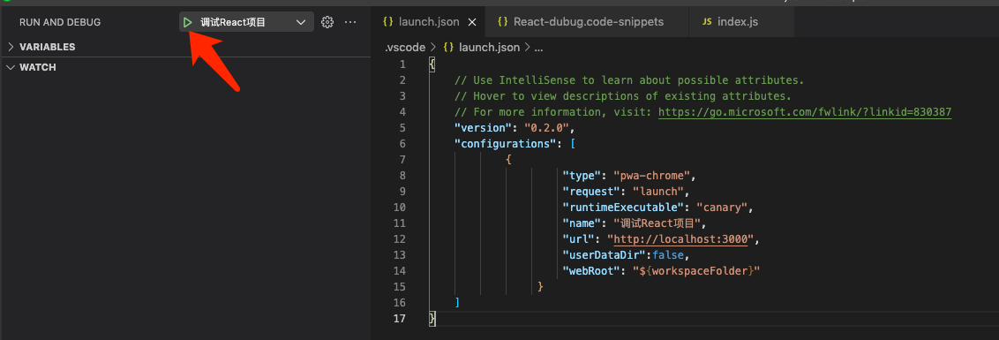


