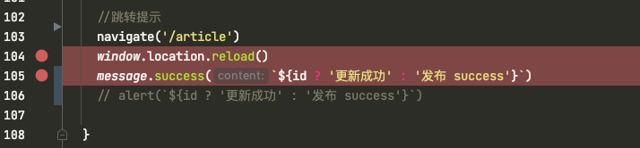
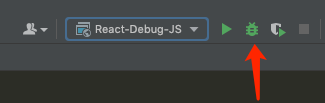
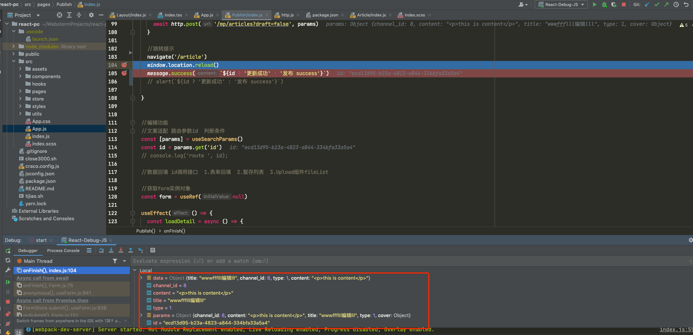

https://andydunkel.net/2021/10/05/react-debugging-with-webstorm/


https://www.jetbrains.com/webstorm/guide/tutorials/react_typescript_tdd/chrome_debugging/


## 主要几个步骤

## 创建一个React项目

```shell
npx create-react-app my-app
cd my-app
yarn start
```

## 设置断点




## 设置配置项


## 开启调试






