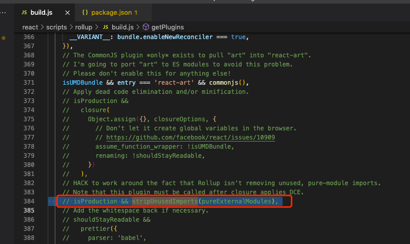
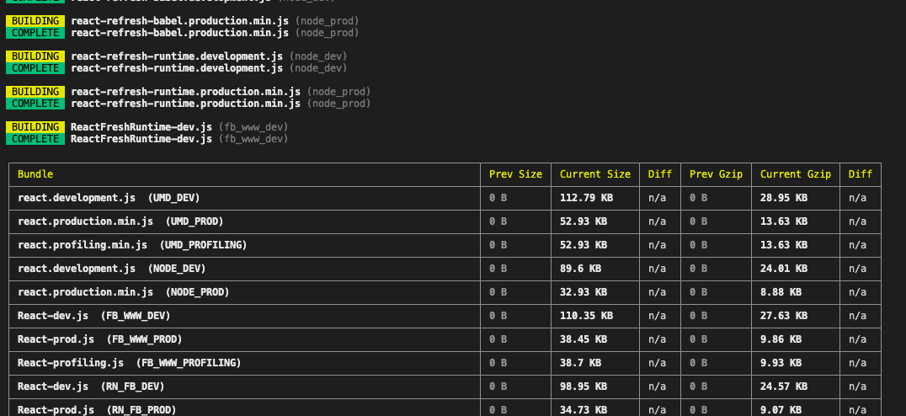
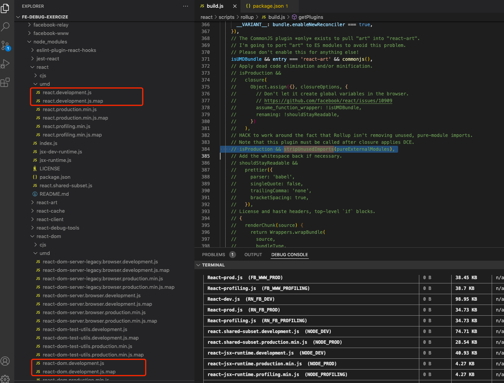
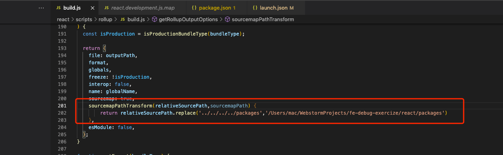

https://github.com/neroneroffy/react-source-code-debug


https://juejin.cn/post/7014775797596553230


## 优质资源(通过调试源代码来理解react的运行原理)

https://www.youtube.com/playlist?list=PLvx8w9g4qv_p-OS-XdbB3Ux_6DMXhAJC3


## 调试小册中的方法

```shell
git clone git@github.com:facebook/react.git

cd react

yarn  install

$npm run build

Sourcemap is likely to be incorrect: a plugin (at position 6) was used to transform files, but didn't generate a sourcemap for the transformation. Consult the plugin documentation for help

#需要注释几个插件

```

除了光佬说的那几个,还有一行需要注意也要注释掉:



而后:build

`npm run build`

结束:



注意:下面这四个文件挺有用的:



```shell
$pwd
/Users/mac/WebstormProjects/fe-debug-exercize

$cd react-source-debug

$pwd
/Users/mac/WebstormProjects/fe-debug-exercize/react-source-debug

yarn install

$pwd
/Users/mac/WebstormProjects/fe-debug-exercize/react-source-debug/node_modules
$cp /Users/mac/WebstormProjects/fe-debug-exercize/react/build/node_modules/react-dom/umd/react-dom.development.js.map .


$pwd
/Users/mac/WebstormProjects/fe-debug-exercize/react-source-debug/node_modules
$cp /Users/mac/WebstormProjects/fe-debug-exercize/react/build/node_modules/react/umd/react.development.js.map .
```




```
sourcemapPathTransform(relativeSourcePath,sourcemapPath) { 
        return relativeSourcePath.replace('../../../../packages','/Users/mac/WebstormProjects/fe-debug-exercize/react/packages')
    },
```

react源码项目重写打包:

```shell

$pwd
/Users/mac/WebstormProjects/fe-debug-exercize/react
$npm run build

#再次 复制map文件
$pwd
/Users/mac/WebstormProjects/fe-debug-exercize/react-source-debug/node_modules
$cp /Users/mac/WebstormProjects/fe-debug-exercize/react/build/node_modules/react/umd/react.development.js.map .
$cp /Users/mac/WebstormProjects/fe-debug-exercize/react/build/node_modules/react-dom/umd/react-dom.development.js.map .
```


