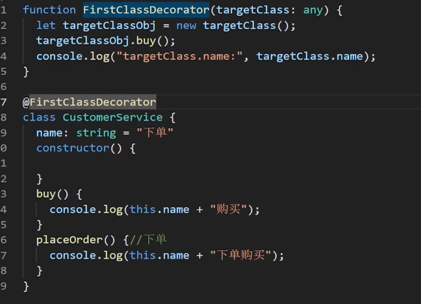
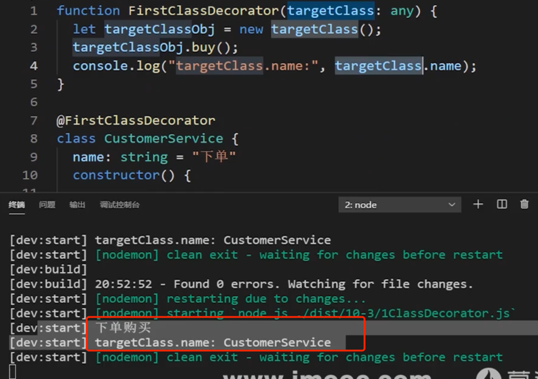
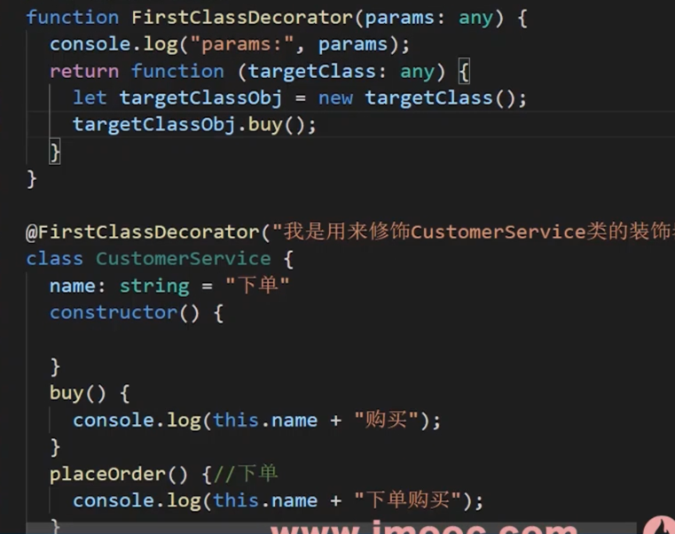

**装饰器要解决的问题：**

**装饰器就是解决在不修改原来类、方法，属性，参数的时候为其添加额外的功能**。比如：为整个项目的所有业务类【假如50个类】的所有方法【假如6个方法】都增加日志信息，如果一个一个的增加，那要增加300次日志调用语句，假如日后日志文件格式发生了改变，也还需要修改300次。 如果有了装饰器，只需要修改一次就可以。这个属于项目中的通用功能，大家了解下即可，后面我们仿 Nestjs 实战 时对装饰器的这个特性会有很深的体会。


## 3. 装饰器分类：

常见的装饰器：类装饰器、属性装饰器、方法装饰器、参数装饰器，元数据装饰器。


##  4. 元数据装饰器初步理解：

元数据装饰器：在定义类或者类方法或者对象的时候，可以设置一些元数据，我们可以获取到在类与类方法上添加的元数据，需要引入 reflect-metadata 第三方库  采用 @Reflect.metadata来实现。元数据指的是描述东西时用的数据，例如：Reflect.metadata("importinfo", "疫情期间用公筷,戴口罩")。

特征 1.:前面有`@`   2.可以写在函数,类，属性等的上面

##  5. 装饰器两种写法：

**写法1：**让调用时（使用时） 不传递参数的装饰器

**写法2**：装饰器工厂【让调用时 可以传递参数的装饰器】。


## 10-3   【类装饰器】类装饰器实现

### 类装饰器两种实现 [带参数和不带参数]

   ```js
   // 不带参数的类装饰器案例：
   function FirstClassDecorator(targetClass: any) {
       console.log(targetClass.prototype.constructor.name + "信息");
       Object.keys(targetClass.prototype).forEach((methodname) => {
         console.log("方法", methodname)
         let dataprop = Object.getOwnPropertyDescriptor(targetClass.prototype, methodname)
         console.log("方法数据属性:", dataprop);
       })
     }
   }
   
   @FirstClassDecorator
   class CustomerService {
     name: string = "下单"
     constructor() {
   
     }
     buy() {
       console.log(this.name + "购买");
     }
     placeOrder() {//下单
       console.log(this.name + "下单购买");
     }
   }
   
   // 带参数类装饰器案例
   function FirstClassDecorator(classinfo: string) {
     return function (targetClass: any) {
       console.log(targetClass.prototype.constructor.name + "信息");
       Object.keys(targetClass.prototype).forEach((methodname) => {
         console.log("方法", methodname)
         let dataprop = Object.getOwnPropertyDescriptor(targetClass.prototype, methodname)
         console.log("方法数据属性:", dataprop);
       })
     }
   }
   ```






上图目的,利用装饰器给一个类添加了一个方法


### 带参数的装饰器




 

## 10-4   【类装饰器底层源码】逐行深剖底层 JS 源码 
