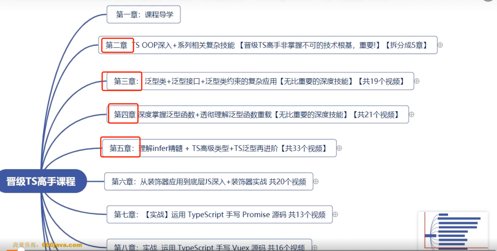
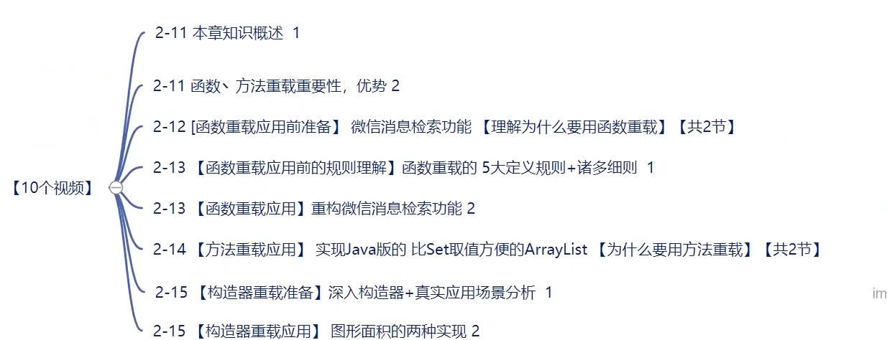
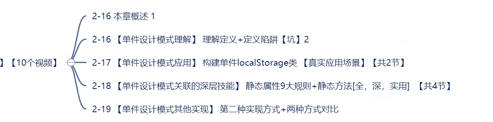

## 概要
整体概要:

2th章:对应 2-1--->2-16

3th章(大厂面试考点):3-1---> 3-10(下图标记有些问题)

4th章节: 4-1 ---> 4-11

5th章节: 5-1--->5-26

6th章节: 6-1 ---> 6-18 

7th章节(泛型--->面试高频考点)
7-1=====>7-21

8th章节: 8-1------>8-18

9th章节: 只看 9-1----->9-25 (涉及到类型体操)

第10章 从装饰器应用，底层 JS 到 仿 Nestjs实战，路由器底层复杂泛型 (可略过)

第11章 运用 TS 手写 Promise 源码

第12章 整合 Vue3 手写高水准大厂的 TS 版 Vuex4 源码(略过)

13th-15th赠送

