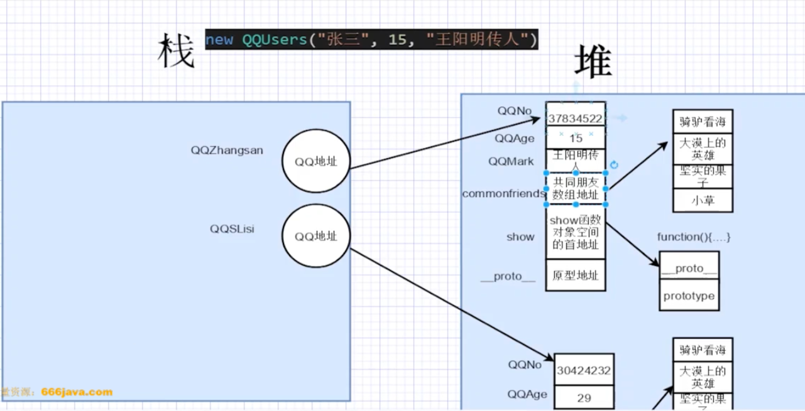
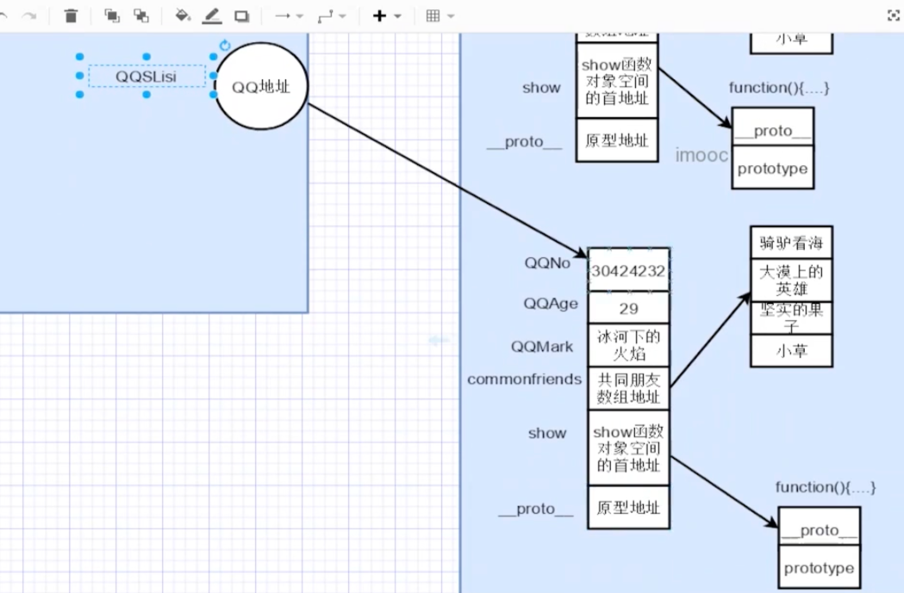
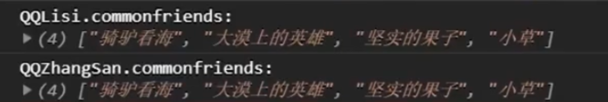
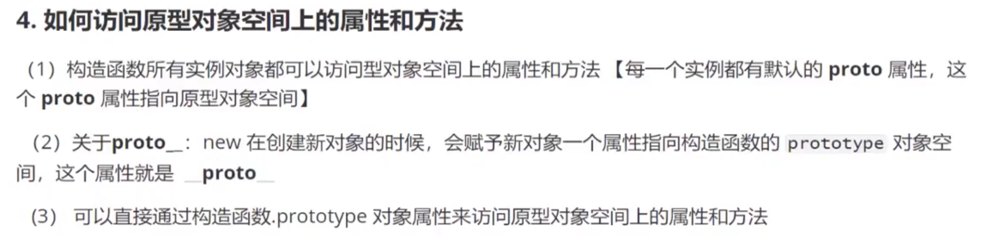
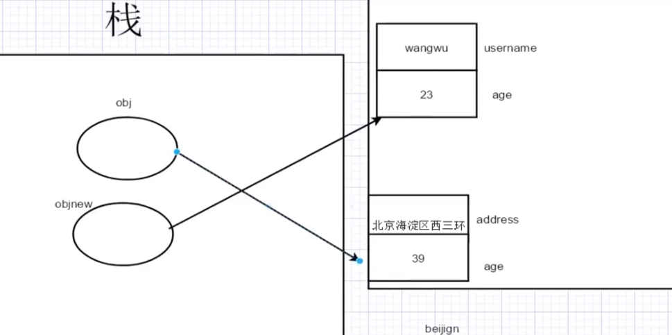

[TOC]

## start

```js

function QQUsers (QQNo_, QQAge_, QQMark_) {
  //3个属性
  this.QQNo = QQNo_;//QQ号
  this.QQAge = QQAge_;//Q龄
  this.QQMark = QQMark_;//QQ标签
  //引用对象类型=引用类型=对象类型=引用数据类型
  // 数组也是一种引用数据类型
  this.commonfriends = ['骑驴看海', '大漠上的英雄', '坚实的果子', '小草']//共同好友
  // 方法也是一种引用数据类型
  this.show = function () {
    console.log(`QQ号:${this.QQNo},QQ龄:${this.QQAge},QQ标注:${this.QQMark}`)
    console.log(`共同的好友是:${this.commonfriends}`);
  }
}
// 对象也叫实例(instance)
// QQZhangSan叫做对象变量 对象是等号右边通过new出来的一个实例 而且是运行期间才在堆中开辟对象的内存空间
let QQZhangSan = new QQUsers("37834522", 15, "王阳明传人") //(a)
let QQLisi = new QQUsers("30424232", 10, "袁隆平的徒弟")
//let QQLiuwu = new QQUsers("刘武", 12, "飞起来的鸭子")

QQZhangSan.show();
QQLisi.show();
//QQLiuwu.show();


```




 

>对象也叫实例(instance);上面代码中的(a)处: QQZhangSan叫做对象变量(也叫做构造函数的实例) 对象是等号右边通过new出来的一个实例 而且是运行期间才在堆中开辟对象的内存空间

上面的例子有个问题(没有原型所带来的的问题):<br>
共同好友在内存里面被分配了两次,导致了内存的浪费

### 为什么要用原型(原型的好处)

原型上面的所有的方法和属性都可以被构造函数的实例所共享

如果没有原型,所有实例上面的共同属性/方法在内存里面会存在多份,导致内存浪费

有了原型之后,就可以把所有实例上面的共同属性放到原型上面去定义

## 2-3


 图(a)-原型图

```js
console.log(QQUsers.prototype);

```
>prototype和上面的QQNo,QQAge属性一样,是属于函数对象的属性(并且这个属性也是一个对象);


QQUsers.prototype有两个属性:
- `constructor`---->他所对应的就是QQUsers这个函数(从内存的角度来讲:constructor里面所对应的内存存放的就是QQUsers这个函数的地址)
- `__proto__`
### 原型定义(面试点,记忆)
原型定义:是定义函数由JS自动分配给函数的一个可以被所有的构造函数实例对象所共享的对象属性(也称为对象变量,其实就是一个属性,只不过这个属性也是一个对象)

- 原型是一个属性,这个属性也是一个对象
- 原型这个属性是被函数对象的所有实例对象所共享的
- 原型(prototype)默认有两个属性:`constructor`和`__proto__`


 将上述的代码改成用原型来写:

```js
function QQUsers (QQNo_, QQAge_, QQMark_) {
  this.QQNo = QQNo_;//QQ号
  this.QQAge = QQAge_;//Q龄
  this.QQMark = QQMark_;//QQ标签
}
//方法栈--执行方法时的栈区

QQUsers.prototype.commonfriends = ['骑驴看海', '大漠上的英雄', '坚实的果子', '小草']
QQUsers.prototype.show = function () {
  console.log(`QQ号:${this.QQNo},QQ龄:${this.QQAge},QQ标注:${this.QQMark}`)
  console.log(`共同的好友是:${this.commonfriends}`);
}

let QQZhangSan = new QQUsers("37834522", 15, "王阳明传人")
let QQLisi = new QQUsers("30424232", 10, "袁隆平的徒弟")
QQUsers.prototype.commonfriends.push("大树");
console.log(QQZhangSan.commonfriends);
console.log(QQLisi.commonfriends);


```


```js

QQUsers.prototype = {
  commonfriends: ["abc", "bcd", '骑驴看海']
}

console.log("QQUsers.prototype:", QQUsers.prototype)
console.log("QQZhangSan.commonfriends:", QQZhangSan.commonfriends)
console.log("QQUsers.prototype.commonfriends:", QQUsers.prototype.commonfriends) 
```


注意顺序: <br>
实例对象访问一个属性/方法的时候,现在实例空间里面去找,如果找到就停止;如果没有找到,就继续在该实例的原型对象中去查找(注意:该实例的原型对象是继承自该实例对象所对应的构造函数的原型的)

举个例子:(以上面代码为例)

QQZhangSan的原型对象是继承自QQUsers的原型对象的;

假设QQZhangSan寻找方法show(),如果在实例对象里面没有找到,就到QQZhangSan的原型对象里面找(其实就是QQUsers的原型对象里面)

## 2-4



关于`__proto__`: new在创建一个新对象的时候,会赋予这个新对象一个属性(这个属性就是`__proto__`),这个属性指向构造函数的` prototype`属性;

可以参考：图(a)-原型图

举个例子(还是以上面那个QQUser的例子为例):
```js
let QQZhangSan = new QQUsers("37834522", 15, "王阳明传人") //(a)
let QQLisi = new QQUsers("30424232", 10, "袁隆平的徒弟")
```
QQZhangSan和QQLisi是QQUsers创建(new)出来的实例对象,QQZhangSan这个实例对象有一个属性,这个属性为`__proto__`,它也是一个对象,并且`__proto__`指向QQUsers这个构造函数的`prototype`属性


再看一个代码:

```js
QQUsers.prototype.commonfriends.push("大树");
console.log(QQZhangSan.commonfriends);
console.log(QQLisi.commonfriends);
```
上面代码的结果: <br>


得到一个重要结论: <br>
>增加或修改原型对象的属性或方法后,所有实例对象是可以立即访问的到的(但是创建实例后再覆盖原型中对应的属性或方法除外)

为了理解: 创建实例后再覆盖原型中对应的属性或方法除外  看下面这个例子:
```js

let obj = { username: "wangwu", age: 23 }
let objnew = obj;


```


```js
obj = { address: "北京海淀区西三环", age: 39 }
console.log("obj:", obj);
console.log("obj2:", objnew)
```


总的代码为:

```js
let obj = { username: "wangwu", age: 23 }//我是上面的obj
let objnew = obj;
console.log("============请注意: obj指向的地址发生了变化, 此时是下面的obj将上面的obj给覆盖了==============");
obj = { address: "北京海淀区西三环", age: 39 }//我是下面的obj
console.log("obj:", obj);
console.log("obj2:", objnew)

```

## 2-5

看一个面试题:

创建实例后再覆盖原型(什么叫覆盖,请看上面obj的那个例子),实例对象无法访问到,为什么？？？


看下图: <br>


看结果:


发现commonfriends这个属性没有变(这个属性没有变,也就是说这个实例对象是无法访问到后面重新写的这个属性,这与上面的obj那个例子相反,为什么？)


