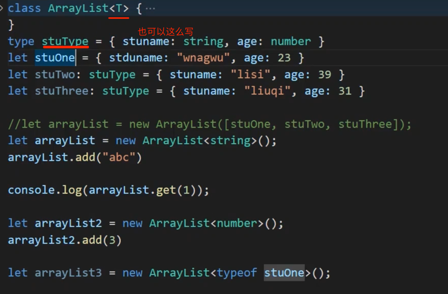

## 为什么要使用泛型类

```ts
/**
 * 把Array数组改写重构提升为Java简易版的ArrayList
 * 
 */
//  1.对现有的数组进行封装，让数组增删改变得更加好用
//  2.提供get方法 remove方法 显示方法【add方法】
// 其中需求中的remove方法有两个，我们用方法重载来实现

class ArrayList {
  //第一步：定义一个引用属性【数组】
  public element: Array<object>
  constructor() {
    this.element = [];
  }
  public index: number = 0;
  // 往数组中添加元素
  public add(ele: object) {
    this.checkIndex();
    this.element[this.index++] = ele;
  }
  public checkIndex() {
    if (this.index < 0) {
      throw new Error("数组下标不能为零");
    }
  }
  // 第二步：根据索引来查询数组中指定元素
  get(index: number): object {
    return this.element[index]
  }

  // 第三步: 显示方法
  show() {
    this.element.forEach((ele) => {
      console.log(ele);
    })
  }

  remove(value: number): number
  remove(value: object): object
  //remove(value: number | object): number | object {
  remove(value: any): any {
    this.element = this.element.filter((ele, index) => {
      //如果是根据数字【元素索引】去删除元素，remove方法返回的是一个数字
      if (typeof value === "number") {
        return value !== index
      } else {
        // 如果是根据对象去删除元素，remove方法返回的是一个对象
        return value !== ele
      }
    })
    return value;
  }

}

let stuOne = { stuname: "wnagwu", age: 23 }
let stuTwo = { stuname: "lisi", age: 39 }
let stuThree = { stuname: "liuqi", age: 31 }

//let arrayList = new ArrayList([stuOne, stuTwo, stuThree]);
let arrayList = new ArrayList();
// arrayList.add(stuOne);
// arrayList.add(stuTwo);
// arrayList.add(stuThree);
//arrayList.add("abc")

console.log(arrayList.get(1));
//arrayList.show();
export { }

//let strList = new ArrayList([stuOne, stuTwo, stuThree]);


```

## 7-3泛型类实现+泛型的好处


 




## 7-4

泛型一种参数化数据类型，具有以下特点的数据类型叫泛型

**特点一**：定义时不明确使用时必须明确成某种具体数据类型的数据类型。【泛型的宽泛】

**特点二**：编译期间进行数据类型安全检查的数据类型。【泛型的严谨】


## 7-5


