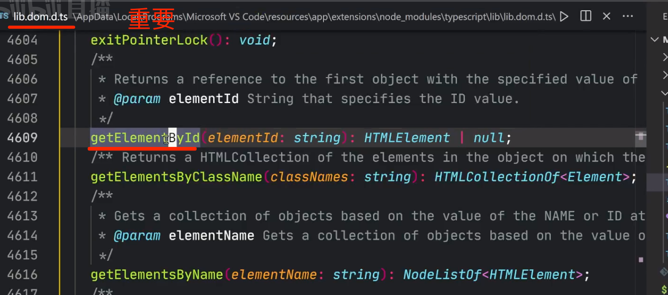
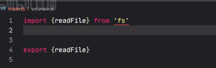
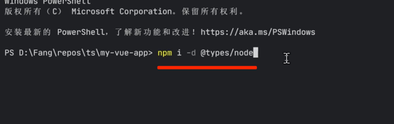
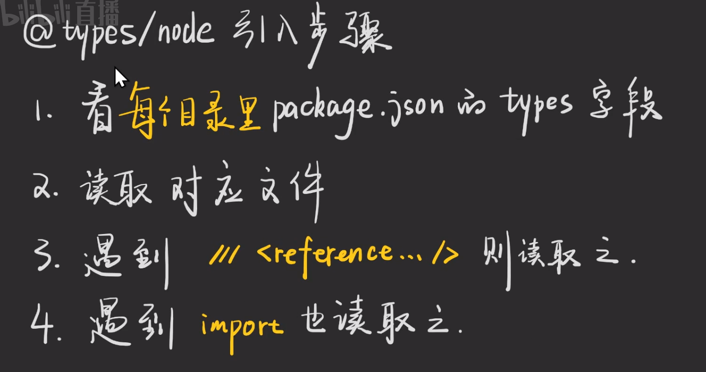
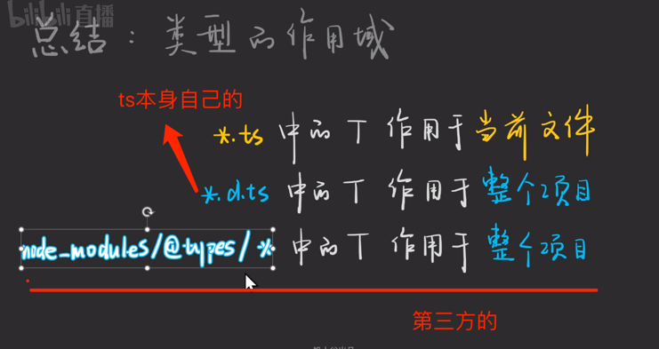
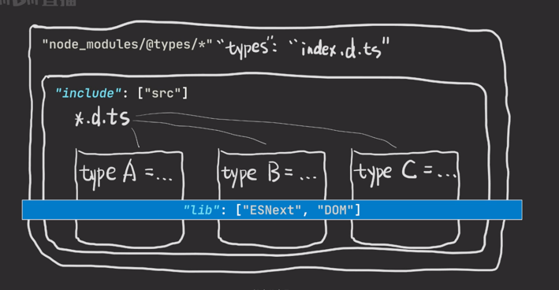
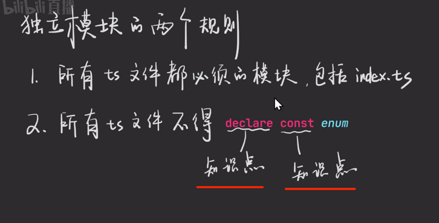
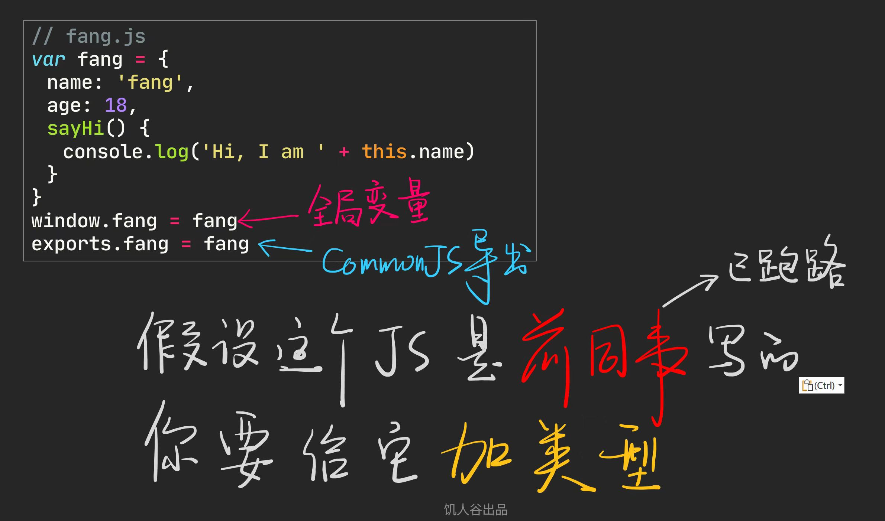
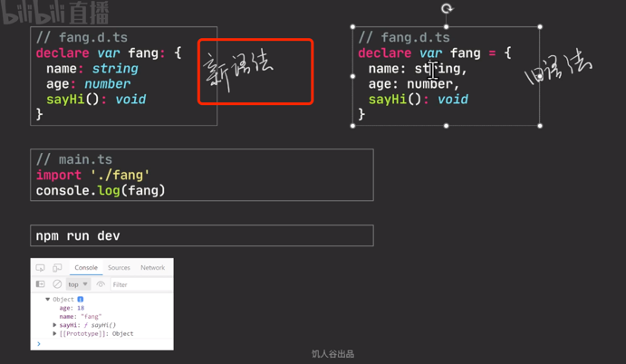

## 前言

3为答案

在 x.ts  =====> 当前文件可用

在 yyy.d.ts,=======>整个项目可用(就是src)

## 例子1

vscode下载了这个库;

这个配置文件告诉vs去用这个dom库

## 例子2

根据报错去google

## 例子3

## 小结

react.d.ts ------> 类型声明(C语言中 ` *.h ` 为声明)

react.js  -------->具体实现(C语言中 `*.c` 为实现)

## 独立模块

1. 所有ts文件都必须为模块,包括`index.ts`
2. 所有ts文件必须不得写 declare, const, enum

## declare

推荐新语法

### 发散思考

2.名字要一样!!!

