## 前言

3为答案

在 x.ts  =====> 当前文件可用

在 yyy.d.ts,=======>整个项目可用(就是src)

## 例子1

vscode下载了这个库;

这个配置文件告诉vs去用这个dom库

## 例子2

根据报错去google

## 例子3

## 小结

react.d.ts ------> 类型声明(C语言中 ` *.h ` 为声明)

react.js  -------->具体实现(C语言中 `*.c` 为实现)

## 独立模块

1. 所有ts文件都必须为模块,包括`index.ts`
2. 所有ts文件必须不得写 declare, const, enum

## declare

推荐新语法

### 发散思考

对于第2点,名字要一样!!!(目录也要在同一个路径下)

## CommJS_全局问题

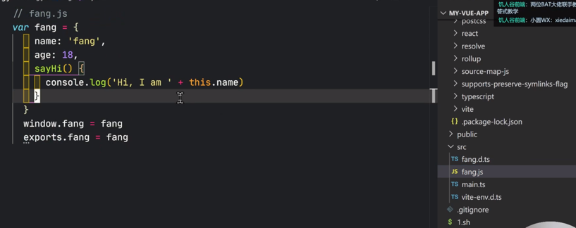

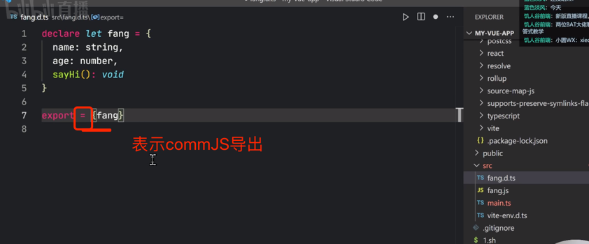

上图中的问题是由于:

vite没有做这个事: node.js中的require转换成为浏览器中的require

再次回顾一下:

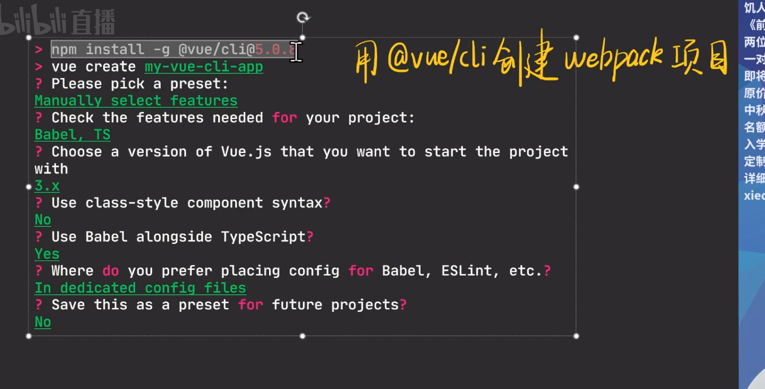

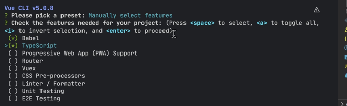

解决方案:

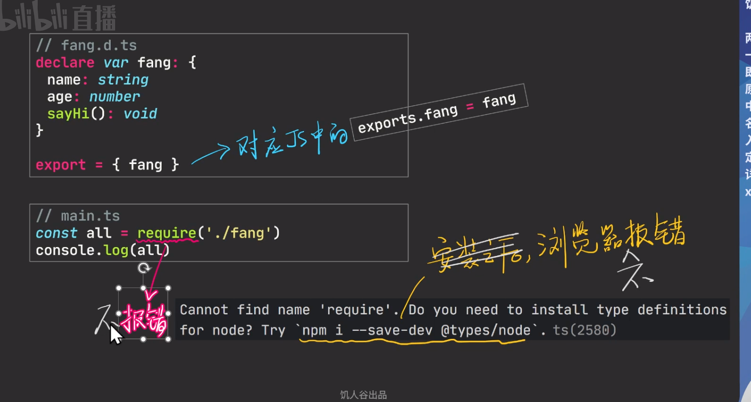

在注意一下:

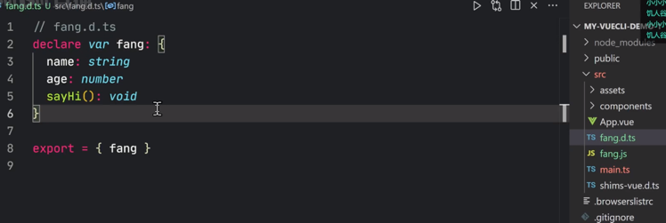

当前是模块的话，就不用全局变量了(declare就不能是全局变量);

不是模块,declare就是全局变量;

### 全局变量+ES6

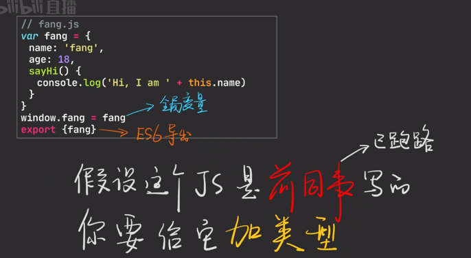

## 总结

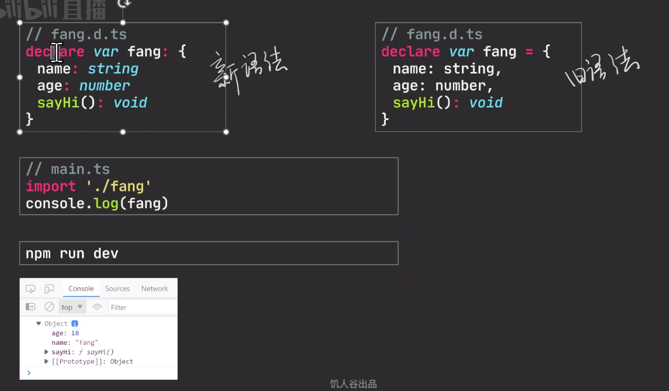

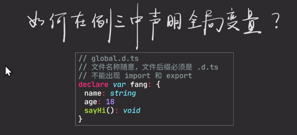

此时的declare就是全局变量,没有export/import;

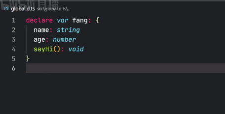

## namespace

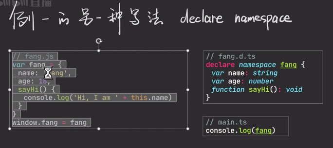

一般不要用`declare var/let/var`

最好这样写:

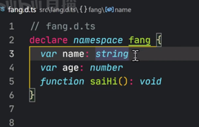

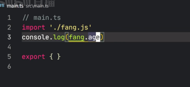

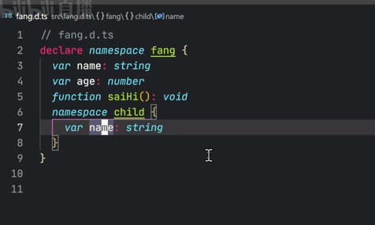

## 最后的总结

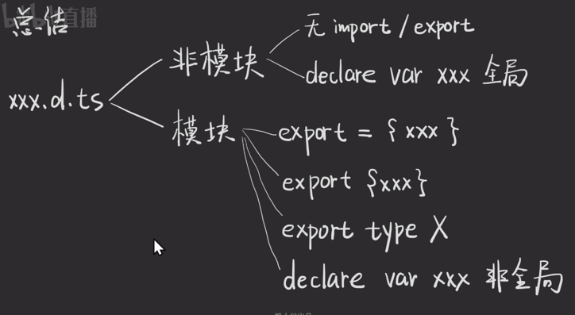

非模块是早期的妥协;

只要是有import/export ----->认为是模块,此时declare声明的不是全局变量

`export ={} `是旧的commJs语法,一般不推荐

`export {} ` 是精华

## 参考

https://ts.xcatliu.com/basics/declaration-files.html

