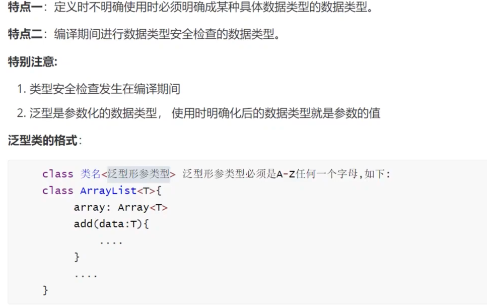
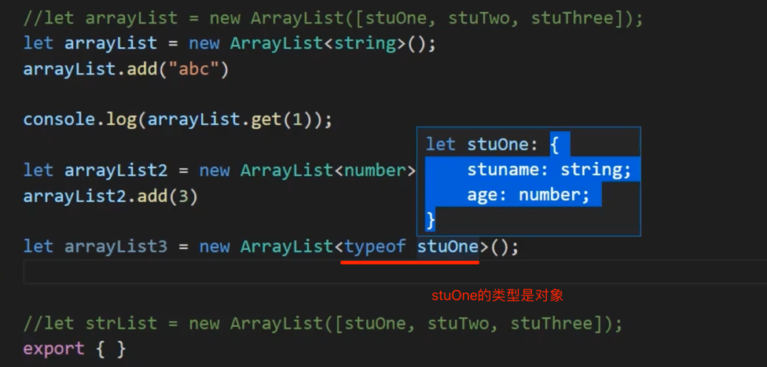
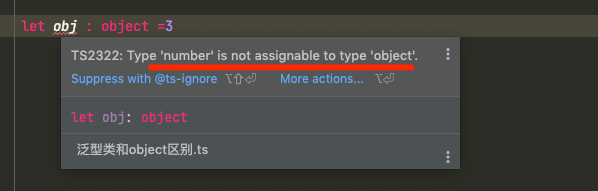
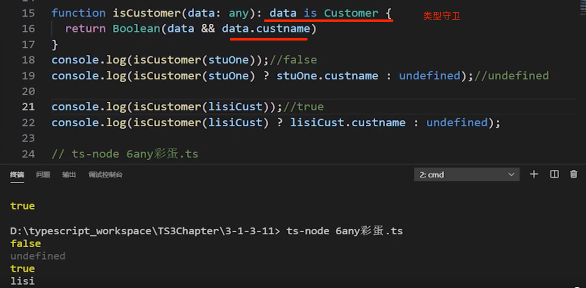

[TOC]

## 为什么要使用泛型类

```ts
/**
 * 把Array数组改写重构提升为Java简易版的ArrayList
 * 
 */
//  1.对现有的数组进行封装，让数组增删改变得更加好用
//  2.提供get方法 remove方法 显示方法【add方法】
// 其中需求中的remove方法有两个，我们用方法重载来实现

class ArrayList {
  //第一步：定义一个引用属性【数组】
  public element: Array<object>
  constructor() {
    this.element = [];
  }
  public index: number = 0;
  // 往数组中添加元素
  public add(ele: object) {
    this.checkIndex();
    this.element[this.index++] = ele;
  }
  public checkIndex() {
    if (this.index < 0) {
      throw new Error("数组下标不能为零");
    }
  }
  // 第二步：根据索引来查询数组中指定元素
  get(index: number): object {
    return this.element[index]
  }

  // 第三步: 显示方法
  show() {
    this.element.forEach((ele) => {
      console.log(ele);
    })
  }

  remove(value: number): number
  remove(value: object): object
  //remove(value: number | object): number | object {
  remove(value: any): any {
    this.element = this.element.filter((ele, index) => {
      //如果是根据数字【元素索引】去删除元素，remove方法返回的是一个数字
      if (typeof value === "number") {
        return value !== index
      } else {
        // 如果是根据对象去删除元素，remove方法返回的是一个对象
        return value !== ele
      }
    })
    return value;
  }

}

let stuOne = { stuname: "wnagwu", age: 23 }
let stuTwo = { stuname: "lisi", age: 39 }
let stuThree = { stuname: "liuqi", age: 31 }

//let arrayList = new ArrayList([stuOne, stuTwo, stuThree]);
let arrayList = new ArrayList();
// arrayList.add(stuOne);
// arrayList.add(stuTwo);
// arrayList.add(stuThree);
//arrayList.add("abc")

console.log(arrayList.get(1));
//arrayList.show();
export { }

//let strList = new ArrayList([stuOne, stuTwo, stuThree]);


```

## 7-3泛型类实现+泛型的好处


 



## 7-4

泛型一种参数化数据类型，具有以下特点的数据类型叫泛型

**特点一**：定义时不明确使用时必须明确成某种具体数据类型的数据类型。【泛型的宽泛】

**特点二**：编译期间进行数据类型安全检查的数据类型。【泛型的严谨】


## 7-5泛型类和Object区别

 object为对象类型;



Object可以为任何类型


```ts
class Customer {
  constructor(public name:string,public age:number) {}
}

// object只能为对象类型;
let obj: object = new Customer("Lili", 23)
// let obj1:object = 3   //这里要报错
//Object可以代表任何类型  
```

### 详细讲解+透彻总结 object  为什么不能替代类上的泛型？

**原因一：编译期间 object 无法进行类型安全检查，而泛型在编译期间可以进行类型安全检查**

object 接受也只能接受所有的 object 类型的变量，比如有 Customer、Student、Dog 类的实例都是对象类型，或者自己定义的对象，都可以传递给 object 类型的方法参数或属性， 但如果我们只希望添加Customer类的对象，当添加其他类的对象必须出现编译错误，但是 object 无法做到，就只能用泛型了。

**原因二: object 类型数据无法接受非 object 类型的变量，只能接受 object 类型的变量，泛型能轻松做到**

正因为 object 接受也只能接受所有的 object 类型的变量，那么如果有一个集合类[数组封装类]有一个 add 方法，允许每次添加指定类型的变量到 add 方法的参数，比如：我们第一轮的希望添加 10 次字符串类型的变量，第二轮的希望添加 10 次整数类型变量，第三轮的希望添加 10 次顾客类型的变量，泛型轻松做到。object 类型数据无法接受任意非 object 类型的变量，object 只能接受所有的 object 类型的变量。

**原因三: object 类型数据获取属性和方法时无自动提示，泛型有自动提示**

一种泛型类型被具体化成某种数据类型后，该数据类型的变量获取属性和方法时会有自动提示，提高代码开发效率和减少出错率，但在 object 类型的变量无法获取数据类型的属性和方法，降低了体验感和开发效率。

#### 7-6详细讲解+透彻总结 any 为什么不能替代类上的泛型？

**原因一：编译期间 any 无法进行类型安全检查，而泛型在编译期间可以进行类型安全检查**

我们学过: any 是所有类型的父类，也是所有类型的子类如果我们现在是一个宠物店类，希望只能添加 Dog 类，当调用 add 方法添加 Customer、Student 类必定出现编译错误，从而保证了类型安全检查，但是 any 类型无法保证类型安全检查，可以为任意类型，包括 string，number，boolean，null，undefined，never，void，unknown 基础数据类型和数组，类，接口类型， type 类型的变量全部能接受，不会进行无法进行类型安全检查。

**原因二：any 类型可以获取任意数据类型的任何属性和任意方法而不会出现编译错误导致潜在错误风险，而泛型却有效的避免了此类问题发生**

any 类型可以获取任何属性和任意方法而不会出现编译错误，因为any可以代表任意数据类型来获取任意属性和任意方法，但是泛型类型被具体化成某种数据类型后，该数据类型的变量调用该数据类型之外的属性和方法时，出现编译错误，这也减少了代码隐藏潜在错误的风险。

**原因三: any 类型数据获取属性和方法时无自动提示，泛型有自动提示**

**彩蛋**：any 类型可以代表任意数据类型来获取任何属性和任意方法而不会出现编译错误，因为any可以代表任意数据类型来获取任意属性和任意方法：【 any 的这个特性是一把双刃剑，当我们需要这么使用，它给我们带来方便，但是大多数情况下我们是不需要这么做的】。




上图中data代表任意类型可以有任意属性任意方法,可以将custname这个属性点出来!!!但是stuOne.custname或者lisiCust.custname是在运行之后才发生的.


