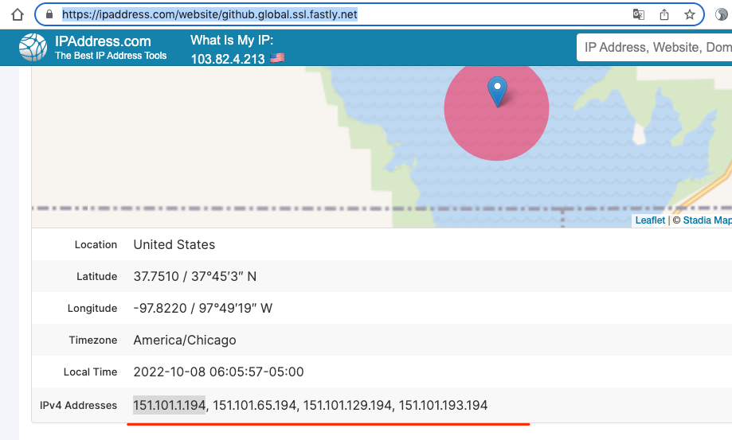

## GitHub无法访问、443 Operation timed out的解决办法


```shell
$sudo sh -c "$(curl --insecure -fsSL https://gitee.com/mirrors/oh-my-zsh/raw/master/tools/install.sh)"
Cloning Oh My Zsh...
fatal: unable to access 'https://github.com/ohmyzsh/ohmyzsh.git/': Failed to connect to github.com port 443: Operation timed out
/Users/mac
Error: git clone of oh-my-zsh repo failed
```


https://juejin.cn/post/6844904193170341896


几个重要地址:

https://ipaddress.com/website/github.com

https://ipaddress.com/website/assets-cdn.github.com

https://ipaddress.com/website/github.global.ssl.fastly.net





```shell
#注意:后面更新的时候地址可能无效了,要找最新的地址
140.82.112.3  github.com 
151.101.1.194  github.global.ssl.fastly.net
151.101.65.194  github.global.ssl.fastly.net
151.101.129.194  github.global.ssl.fastly.net
151.101.193.194  github.global.ssl.fastly.net
185.199.108.153  assets-cdn.github.com
185.199.109.153  assets-cdn.github.com
185.199.110.153  assets-cdn.github.com
185.199.111.153  assets-cdn.github.com
```


