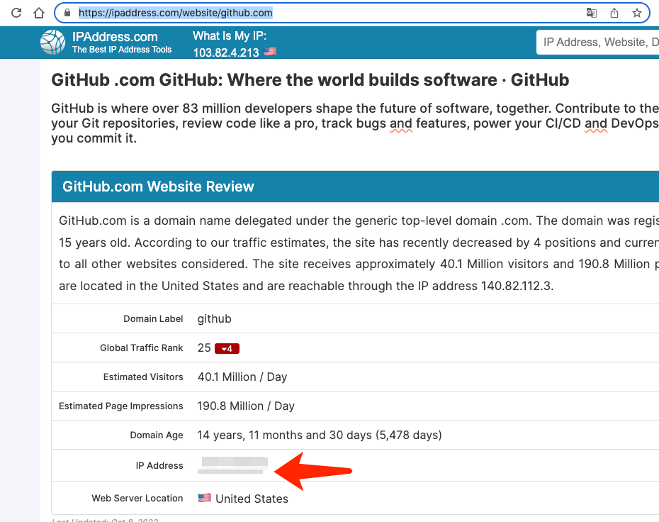
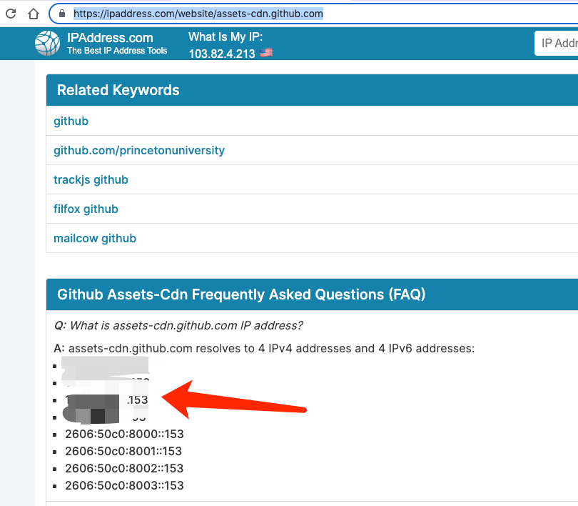

[TOC]

## GitHub无法访问、443 Operation timed out的解决办法


```shell
$sudo sh -c "$(curl --insecure -fsSL https://gitee.com/mirrors/oh-my-zsh/raw/master/tools/install.sh)"
Cloning Oh My Zsh...
fatal: unable to access 'https://github.com/ohmyzsh/ohmyzsh.git/': Failed to connect to github.com port 443: Operation timed out
/Users/mac
Error: git clone of oh-my-zsh repo failed
```


https://juejin.cn/post/6844904193170341896


几个重要地址:

https://ipaddress.com/website/github.com

https://ipaddress.com/website/assets-cdn.github.com

https://ipaddress.com/website/github.global.ssl.fastly.net






```shell
#注意:后面更新的时候地址可能无效了,要找最新的地址,将下面放到 /etc/hosts  中
140.82.112.3  github.com 
151.101.1.194  github.global.ssl.fastly.net
151.101.65.194  github.global.ssl.fastly.net
151.101.129.194  github.global.ssl.fastly.net
151.101.193.194  github.global.ssl.fastly.net
185.199.108.153  assets-cdn.github.com
185.199.109.153  assets-cdn.github.com
185.199.110.153  assets-cdn.github.com
185.199.111.153  assets-cdn.github.com
```


刷新mac 10.14 dns

```shell
sudo killall -HUP mDNSResponder

```


## 设置my zsh

https://zhuanlan.zhihu.com/p/35283688

https://chinese.freecodecamp.org/news/how-to-flush-dns-on-mac-macos-clear-dns-cache/


zsh中目前比较使用的主题: 

```shell
pygmalion-virtualenv

candy

refined

edvardm

gozilla
```
## 升级的时候遇到的一个问题

```shell
$omz update
Updating Oh My Zsh
fatal: unable to access 'https://github.com/ohmyzsh/ohmyzsh.git/': LibreSSL SSL_connect: SSL_ERROR_SYSCALL in connection to github.com:443
There was an error updating.
```

解决方案:

https://hyperzsb.io/posts/git-ssl-error/

```shell
#我使用的是如下这种方式有效的
$ git config --global http.sslBackend "openssl"


```

效果如下:

在`.gitconfig`中多了一行:
```shell
          sslBackend = openssl
```


里面有个终极解决方案:

>之前试了这么多网上的方法，其实都没有找到问题的症结，实在是汗颜。其实这个问题的根本原因在于国内网络环境对于境外服务器的种种限制，只用解决这一问题才能真正意义上解决 GitHub push/pull 网络错误的问题。根据使用的 GitHub 连接方式不同，针对 HTTPS 和 SSH 各有一种方法。

### HTTPS 和 SSH 方法的对比

就一般的环境而言，这两种方法并没有什么区别；但是在配置了防火墙或代理的服务器环境中，SSH 方式可能会收到限制。

>根据 GitHub 官方文档：
>You can work with all repositories on GitHub over HTTPS, even if you are behind a firewall or proxy.
>You can work with all repositories on GitHub over SSH, although firewalls and proxys might refuse to allow SSH connections.

幸运的是，在仅有防火墙端口限制的情况下，现在可以通过 HTTPS 的端口使用 SSH 方式连接 GitHub 服务器，具体方式请参阅 [Using SSH over the HTTPS port](https://docs.github.com/en/authentication/troubleshooting-ssh/using-ssh-over-the-https-port)。


### 使用 HTTPS 代理

在使用 HTTPS 连接 GitHub 进行 push/pull 时（即 origin 地址为 https://github.com/xxx/xxx.git），需要更改本地 git 的配置，使用代理向 GitHub 发起请求。

>要求：你需要有一个梯子，关于如何获取梯子，请自行搜索相关资料（由于政策原因，仅提供一些可用的关键字：机场、FreeWhale、Meet）。

执行如下命令：

```shell
$ git config --global -e
```
这将进入 git 的配置文件编辑界面（将使用 git 指定的默认编辑器打开）。

在该文件中加入如下内容：

```shell
[http]
        proxy = socks5://127.0.0.1:7891
[https]
        proxy = socks5://127.0.0.1:7891
```
其中“7891”为你的代理软件的指定出入端口，请根据实际情况自行修改。


### 使用 SSH 方法

众所周知在 clone GitHub 仓库时可以使用 HTTPS 或者 SSH 进行 clone，而 SSH 却没有 HTTPS 的网络连接问题，所以可以将 push/pull 的连接方式由 HTTPS 改为 SSH。

>要求：你需要提前生成 SSH 公私钥对，并将公钥添加到你的 GitHub 账户中。关于这一部分的详细信息，请参阅 Connecting to GitHub with SSH。

进入仓库对应目录，执行如下命令：

```shell
$ git remote set-url origin git@github.com:xxx/xxx.git

```

更改完成后，可以使用如下命令查看当前的 origin 地址：

```shell
$ git remote -v

```

### 升级所遇到问题的参考
https://stackoverflow.com/questions/48987512/ssl-connect-ssl-error-syscall-in-connection-to-github-com443

https://docs.github.com/en/get-started/getting-started-with-git/managing-remote-repositories#switching-remote-urls-from-https-to-ssh


