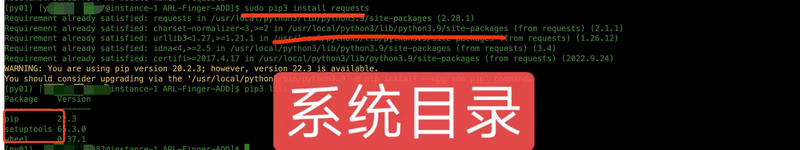

## 问题描述

为啥requests老安装不上？？


不是提示有这个包了吗.

但是运行程序总是报  `ModuleNotFoundError: No module named 'requests' `  这个错

可能原因:

你下载的python，和用的python不是一个python

```shell
pip3 -V
pip 22.3 from /home/username/.virtualenvs/py01/lib/python3.9/site-packages/pip (python 3.9)
```


解决方法：

不要加sudo(如果加了sudo说明安装在系统目录下)


原因:

你虚拟环境下的python并没有装requests, 外面有 requests 的是系统本身的python，和你用的不是同一个




下载，准确表述，应该是pip包下载安装，也就是 pip install的目标路径

## 总结

sudo 相当于切换到 root 环境

不加sudo 是你当前环境变量，用的当前的venv

加不加 sudo ，分别看下 pip  -V，应该就能清楚了,或者 which pip